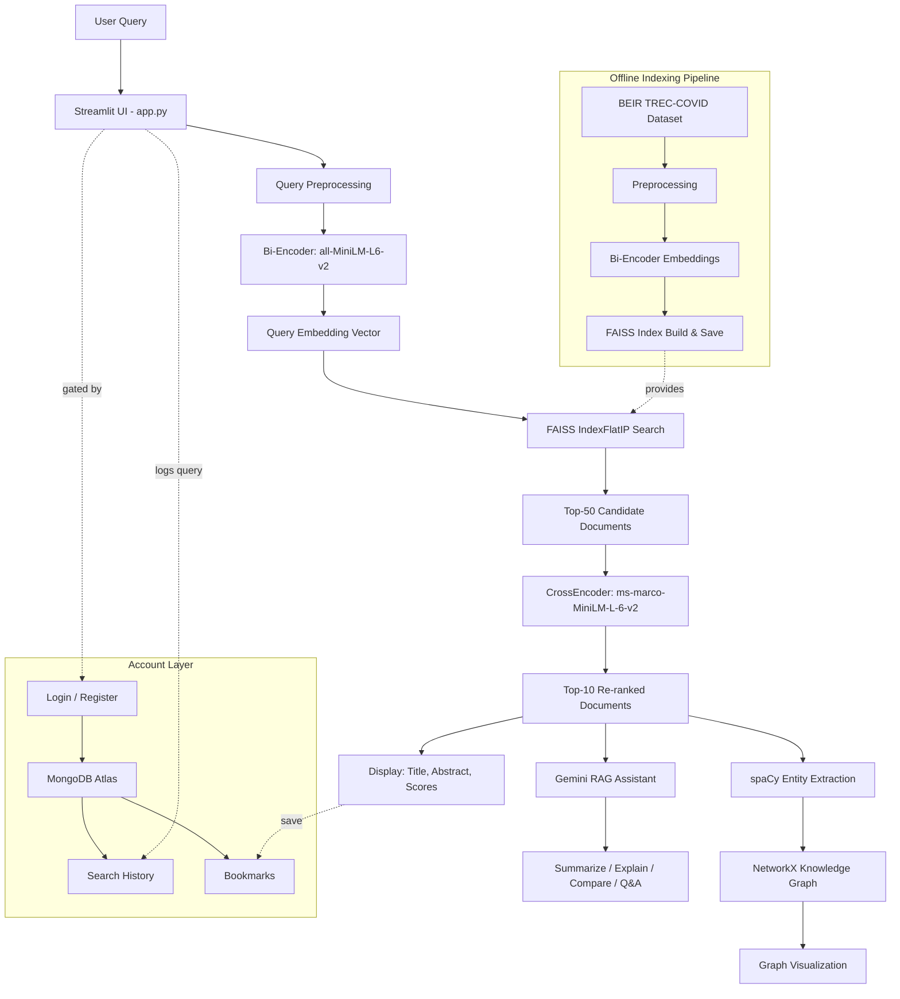
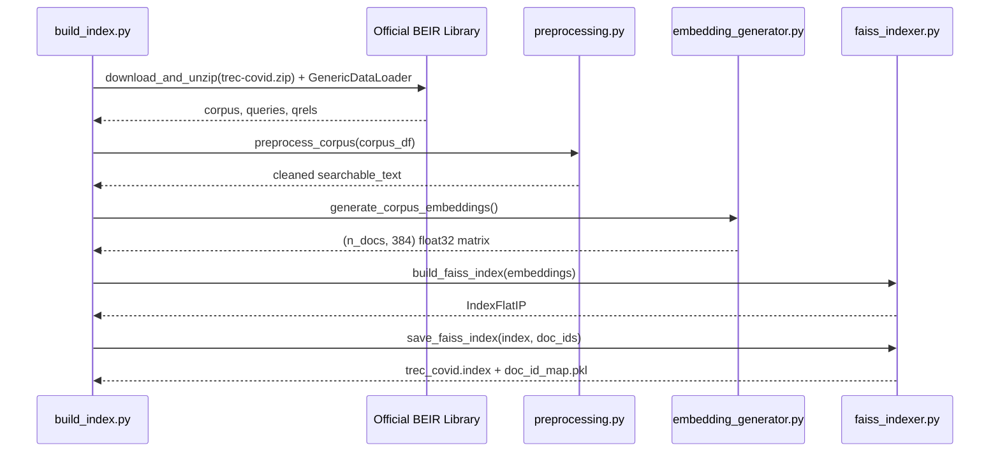
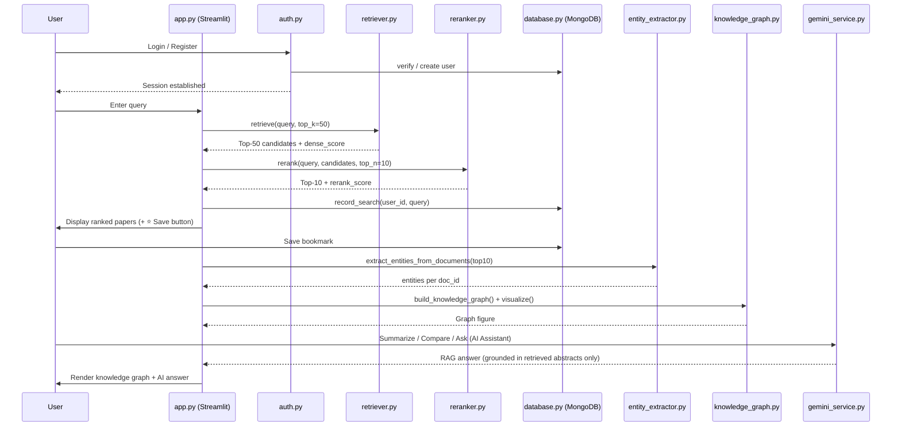

# 🦠 COVID-19 Information Retrieval System with Pre-trained LLMs and Knowledge Graph

An intelligent Information Retrieval (IR) system that accepts natural-language COVID-19 research
queries and returns the most relevant scientific papers from the **BEIR TREC-COVID** dataset,
using **dense retrieval (FAISS + SentenceTransformer)**, **Cross-Encoder re-ranking**, **spaCy
entity extraction**, and a **NetworkX knowledge graph**.

The system now also includes a full **account layer** (login/register, MongoDB-backed search
history and bookmarks, a user profile) and a **Gemini-powered AI Assistant** that summarises,
explains, compares, and answers questions about your retrieved papers using Retrieval-Augmented
Generation (RAG) — Gemini never searches the corpus itself; it only reasons over papers the
existing retrieval pipeline has already found.

---

## 1. Project Architecture



## 2. Data Flow (Offline Indexing)



## 3. Query-Time Flow



---

## 4. Folder Structure

```
covid19-ir-system/
├── app.py                     # Streamlit web application (entry point: auth gate + dashboard)
├── build_index.py             # Offline pipeline: dataset -> embeddings -> FAISS index
├── run_evaluation.py          # Standalone IR evaluation script (P@10, R@10, MAP, MRR, NDCG@10)
├── requirements.txt           # Python dependencies
├── .env.example                # Template for MongoDB URI + Gemini API key (copy to .env)
├── README.md                  # This file
│
├── src/                       # Core modular source code
│   ├── __init__.py
│   ├── config.py              # Central configuration (paths, model names, hyperparameters, .env-loaded secrets)
│   ├── data_loader.py         # Downloads / caches BEIR TREC-COVID via the official beir library
│   ├── preprocessing.py       # Text cleaning & normalisation
│   ├── embedding_generator.py # SentenceTransformer (all-MiniLM-L6-v2) embeddings
│   ├── faiss_indexer.py       # FAISS IndexFlatIP build / save / load / search
│   ├── retriever.py           # DenseRetriever: query -> Top-K candidate documents
│   ├── reranker.py            # CrossEncoder (ms-marco-MiniLM-L-6-v2) re-ranking
│   ├── entity_extractor.py    # spaCy NER + domain keyword rules (virus/drug/vaccine/protein)
│   ├── knowledge_graph.py     # NetworkX graph construction & Matplotlib visualization
│   ├── evaluation.py          # Precision@K, Recall@K, MAP, MRR, NDCG@K
│   ├── utils.py               # Shared helper functions
│   ├── database.py            # ⭐ NEW — MongoDB Atlas connection & CRUD (users/history/bookmarks)
│   ├── auth.py                # ⭐ NEW — Registration, login, logout, bcrypt hashing, session state
│   ├── history.py             # ⭐ NEW — Search-history logging + "Search History" page
│   ├── bookmark.py            # ⭐ NEW — Save/remove papers + "Saved Papers" page
│   ├── profile.py             # ⭐ NEW — "Profile" page (account info + usage stats)
│   └── gemini_service.py      # ⭐ NEW — Gemini RAG assistant (summarize/explain/compare/Q&A)
│
├── data/
│   ├── raw/                   # Downloaded BEIR TREC-COVID archive contents
│   └── processed/             # Cached corpus.parquet, queries.parquet, qrels.parquet
│
├── embeddings/                 # Saved corpus_embeddings.npy + corpus_doc_ids.pkl
├── faiss_index/                 # Saved trec_covid.index + doc_id_map.pkl
├── results/                    # evaluation_results.json, knowledge_graph.png
├── assets/                     # Screenshots / diagrams for documentation
└── notebooks/                   # (Optional) exploratory Jupyter notebooks
```

---

## 5. Technologies & Models

| Component            | Technology / Model                                  |
|----------------------|-------------------------------------------------------|
| Language              | Python 3.10+                                          |
| IDE                   | VS Code                                                |
| Dense Embeddings      | `sentence-transformers/all-MiniLM-L6-v2` (384-dim)     |
| Re-ranking            | `cross-encoder/ms-marco-MiniLM-L-6-v2`                 |
| Vector Search         | FAISS (`IndexFlatIP`, exact cosine via normalised vectors) |
| NER                   | spaCy `en_core_web_sm` + custom EntityRuler patterns   |
| Graph                 | NetworkX (spring layout) + Matplotlib rendering        |
| Web UI                | Streamlit                                              |
| Data handling         | Pandas, NumPy, PyArrow (Parquet caching)               |
| Evaluation            | Custom implementation (scikit-learn used for supporting utilities) |
| **Database**          | **MongoDB Atlas** (users, search_history, bookmarks collections) |
| **Authentication**    | **bcrypt** password hashing, Streamlit session state   |
| **AI Assistant**      | **Google Gemini API** (`gemini-1.5-flash`), used strictly for post-retrieval RAG |
| **Secrets management**| **python-dotenv** (`.env` file, never hard-coded)      |

---

## 6. Account, Database & AI Assistant Setup

This section covers the **new** setup steps. If you only care about the original retrieval
pipeline, you can skip straight to [Section 7](#7-installation-macos--vs-code) — but note that
**login is required to use the app**, so MongoDB Atlas configuration is not optional.

### 6.1 MongoDB Atlas Setup

1. Go to [https://www.mongodb.com/cloud/atlas/register](https://www.mongodb.com/cloud/atlas/register) and create a free account.
2. Create a new **Project**, then click **Build a Database** and choose the **free M0 tier**.
3. Choose a cloud provider/region (any is fine) and click **Create**.
4. Under **Security → Database Access**, click **Add New Database User**:
   - Choose "Password" authentication, set a username and password (save these).
   - Grant "Read and write to any database" privileges.
5. Under **Security → Network Access**, click **Add IP Address**:
   - For local development, click **Allow Access from Anywhere** (`0.0.0.0/0`), or add your
     current IP address specifically.
6. Go back to **Database → Connect** on your cluster, choose **Drivers**, select **Python**, and
   copy the connection string. It looks like:
   ```
   mongodb+srv://<username>:<password>@cluster0.xxxxx.mongodb.net/?retryWrites=true&w=majority
   ```
7. Replace `<username>` and `<password>` with the database user credentials from step 4.
8. Paste this into your `.env` file (see Section 6.3) as `MONGO_URI`.

The application will automatically create the `users`, `search_history`, and `bookmarks`
collections (and required indexes) the first time it runs — no manual collection setup needed.

### 6.2 Google Gemini API Setup

1. Go to [https://aistudio.google.com/app/apikey](https://aistudio.google.com/app/apikey) and sign
   in with a Google account.
2. Click **Create API Key** (choose or create a Google Cloud project if prompted).
3. Copy the generated API key.
4. Paste it into your `.env` file (see Section 6.3) as `GEMINI_API_KEY`.

> The AI Assistant page will show a friendly warning instead of crashing if this key is not
> configured — every other feature (search, history, bookmarks, knowledge graph) works fine
> without it.

### 6.3 Create Your `.env` File

From the project root:
```bash
cp .env.example .env
```
Then edit `.env` and fill in your values:
```env
MONGO_URI=mongodb+srv://<username>:<password>@cluster0.xxxxx.mongodb.net/?retryWrites=true&w=majority
MONGO_DB_NAME=covid_ir_system
GEMINI_API_KEY=your_gemini_api_key_here
GEMINI_MODEL_NAME=gemini-1.5-flash
```

**Never commit `.env` to version control** — it's already listed in `.gitignore`. Both the
MongoDB URI and Gemini API key are loaded exclusively from environment variables via
`python-dotenv`; they are never hard-coded anywhere in the source code.

---

## 7. Installation (macOS + VS Code)

### 7.1 Prerequisites
- Python 3.10 or 3.11 installed (check with `python3 --version`)
- VS Code with the **Python** extension installed
- ~4 GB free disk space (models + embeddings + FAISS index)
- Stable internet connection (first run only, to download the dataset & models)
- A MongoDB Atlas connection string and (optionally) a Gemini API key — see Section 6

### 7.2 Step-by-step Setup

```bash
# 1. Clone / unzip the project and open it in VS Code
cd covid19-ir-system
code .

# 2. Create and activate a virtual environment
python3 -m venv venv
source venv/bin/activate          # macOS / Linux
# venv\Scripts\activate            # Windows (if applicable)

# 3. Upgrade pip and install dependencies
pip install --upgrade pip
pip install -r requirements.txt
```
This installs the **official `beir` library** (required to correctly download and parse the
TREC-COVID dataset), plus the new account-layer dependencies: `pymongo`, `bcrypt`,
`python-dotenv`, `email-validator`, and `google-generativeai`.

```bash
# 4. Download the spaCy English model (required for entity extraction)
python -m spacy download en_core_web_sm

# 5. Set up your secrets
cp .env.example .env
# then edit .env with your MongoDB URI and Gemini API key (see Section 6)
```

> In VS Code, select the `venv` interpreter via
> `Cmd+Shift+P` → "Python: Select Interpreter" → choose `./venv/bin/python`.

---

## 8. Running the Project

### Step 1 — Build the dense retrieval index (run once)
```bash
python build_index.py
```
This downloads the BEIR TREC-COVID dataset (cached as Parquet), cleans the text, generates
embeddings with `all-MiniLM-L6-v2`, and saves a FAISS index to `faiss_index/`.

> For a quick local smoke-test on a laptop, limit the corpus size:
> `python build_index.py --max-docs 20000`

### Step 2 — Launch the Streamlit web app
```bash
streamlit run app.py
```
Open the printed local URL (typically `http://localhost:8501`) in your browser.

**First-time use:**
1. You'll land on the **Login / Register** page. Click the **Register** tab, fill in your name,
   email, and password (confirmed twice), and click **Create Account**.
2. Switch to the **Login** tab and sign in with those credentials.
3. You'll be redirected to the **Dashboard**, where you can navigate to Search, History,
   Bookmarks, AI Assistant, or Profile via the cards or the sidebar.
4. Run a search on the **Search Research Papers** page — it's automatically saved to your
   **Search History**, and every result has a **⭐ Save** button to bookmark it.
5. After searching, visit **AI Assistant** to summarize, compare, explain terminology, or ask
   questions about the papers you just retrieved (requires `GEMINI_API_KEY`).

### Step 3 — Run the standalone evaluation (optional)
```bash
python run_evaluation.py
```
Prints Precision@10, Recall@10, MAP, MRR, NDCG@10 averaged over the 50 official TREC-COVID
topics, and saves the full breakdown to `results/evaluation_results.json`. This evaluates the
core retrieval pipeline only and is unaffected by the account/AI-assistant features.

---

## 9. Module-by-Module Explanation

| File | Responsibility |
|------|-----------------|
| **`config.py`** | Single source of truth for file paths, model identifiers, tunable hyperparameters, and — now — `.env`-loaded secrets (`MONGO_URI`, `GEMINI_API_KEY`) and account-layer constants (collection names, bcrypt cost factor, session-state keys). |
| **`data_loader.py`** | Uses the official `beir` library (`beir.util.download_and_unzip` + `beir.datasets.data_loader.GenericDataLoader`) to download and correctly parse the TREC-COVID archive, then converts BEIR's native dict format into the project's standard Pandas DataFrame schema and caches it as Parquet. |
| **`preprocessing.py`** | Strips HTML tags, URLs, and control characters; combines a (duplicated) title with the abstract into a single `searchable_text` field; drops empty documents. |
| **`embedding_generator.py`** | Loads `all-MiniLM-L6-v2` via `sentence-transformers`, encodes text in batches with L2 normalisation, and persists the resulting matrix + doc-id order to disk. |
| **`faiss_indexer.py`** | Builds a `faiss.IndexFlatIP` (exact inner-product search) over the embedding matrix, and provides save/load/search helpers. |
| **`retriever.py`** | `DenseRetriever` class: cleans the query, embeds it, searches the FAISS index, and joins the results back to their title/abstract text. |
| **`reranker.py`** | Feeds `(query, document)` pairs jointly through `cross-encoder/ms-marco-MiniLM-L-6-v2` to produce a fine-grained relevance score. |
| **`entity_extractor.py`** | Runs spaCy's statistical NER plus a custom `EntityRuler` seeded with COVID-specific keyword lists (viruses, drugs, vaccines, proteins). |
| **`knowledge_graph.py`** | Builds a `networkx.Graph` linking each result document to its extracted entities, plus entity-entity co-occurrence edges; renders a colour-coded visualization. |
| **`evaluation.py`** | Implements Precision@K, Recall@K, MAP, MRR, and NDCG@K from first principles against the official qrels. |
| **`build_index.py`** | Orchestrates the full offline pipeline (load → preprocess → embed → index) as a single CLI command. |
| **`run_evaluation.py`** | Orchestrates retrieval + re-ranking across all 50 official topics and reports system-level IR metrics. |
| **`database.py`** ⭐ | The **only** module that talks to MongoDB directly. Connection management (`get_client`/`get_db`), index creation, and CRUD helpers for the `users`, `search_history`, and `bookmarks` collections. |
| **`auth.py`** ⭐ | Email format validation, password strength validation, bcrypt hashing/verification, `register_user()`/`login_user()`/`logout_user()` logic, and the Streamlit Login/Register UI (`render_auth_page()`). Manages `st.session_state` for the logged-in user and current dashboard page. |
| **`history.py`** ⭐ | `record_search()` (called automatically after every search) plus `render_history_page()` — view, delete individual entries, or clear all search history. |
| **`bookmark.py`** ⭐ | `toggle_bookmark()`, the inline **⭐ Save** button renderer used on each search result, and `render_bookmarks_page()` — the "Saved Papers" page. |
| **`profile.py`** ⭐ | `render_profile_page()` — displays name, email, account-creation date, total searches, and total saved papers (via `database.py` count queries). |
| **`gemini_service.py`** ⭐ | Configures the Gemini client from `GEMINI_API_KEY`. Implements `summarize_paper()`, `explain_terminology()`, `compare_papers()`, `generate_key_findings()`, and `answer_question()` — all strictly Retrieval-Augmented: every prompt embeds the already-retrieved paper title(s)/abstract(s) as context and explicitly instructs Gemini not to use outside knowledge. |
| **`app.py`** | Entry point. Gates access behind `auth.is_logged_in()`, then routes between Dashboard / Search / History / Bookmarks / AI Assistant / Profile via sidebar + dashboard-card navigation. The core retrieval pipeline (`retriever.retrieve` → `reranker.rerank` → `entity_extractor` → `knowledge_graph`) is unchanged from the original implementation; it is now wrapped with history logging and per-result bookmark buttons. |

---

## 10. Sample Input & Output

**Sample Query:**
```
What are the effects of remdesivir on COVID-19 patients?
```

**Sample Top-3 Output (illustrative):**

| Rank | Title | Dense Score | Re-rank Score |
|------|-------|--------------|----------------|
| 1 | Remdesivir for the Treatment of Covid-19 — Final Report | 0.812 | 8.42 |
| 2 | Compassionate Use of Remdesivir for Patients with Severe Covid-19 | 0.799 | 7.95 |
| 3 | Clinical course and outcomes of critically ill COVID-19 patients | 0.741 | 5.10 |

**Sample extracted entities (from Rank #1 paper):**
```json
[
  {"text": "Remdesivir", "label": "DRUG"},
  {"text": "COVID-19", "label": "VIRUS"},
  {"text": "NIH", "label": "ORGANIZATION"}
]
```

**Sample Gemini AI Assistant output ("Key Findings" tab, illustrative):**
```
- [Paper 1] Remdesivir shortened median recovery time compared to placebo.
- [Paper 2] Compassionate-use remdesivir was associated with clinical improvement
  in the majority of severe COVID-19 cases studied.
- [Paper 3] Critically ill patients showed high rates of ARDS and multi-organ
  complications, independent of antiviral treatment.
```

**Sample evaluation output:**
```
===== EVALUATION RESULTS =====
Precision@10   : 0.6720
Recall@10      : 0.1187
MAP            : 0.2932
MRR            : 0.8571
NDCG@10        : 0.6104
Queries evaluated: 50
```
*(Numbers are illustrative — your exact figures will depend on hardware, corpus size used, and model versions.)*

---

## 11. Screenshots to Capture (for your report/presentation)

1. **Login / Register page** — both tabs.
2. **Dashboard** — welcome message + navigation cards.
3. **Terminal** — output of `python build_index.py` completing all 4 pipeline steps.
4. **Search page** — a typed query with the sidebar settings visible.
5. **Top-10 results view** — expandable cards showing title, abstract, dense score, rerank score, and the ⭐ Save button.
6. **Knowledge graph visualization** — the colour-coded NetworkX graph rendered in the app.
7. **AI Assistant** — each tab (Key Findings, Compare Papers, Explain Terminology, Ask a Question) with a sample response.
8. **Search History page** — with a few logged queries.
9. **Saved Papers (Bookmarks) page** — with a few bookmarked papers.
10. **Profile page** — showing account stats.
11. **Terminal output of `python run_evaluation.py`** — showing all five metrics.

---

## 12. Troubleshooting

| Issue | Fix |
|-------|-----|
| `FileNotFoundError: FAISS index not found` | Run `python build_index.py` before `streamlit run app.py`. |
| `OSError: en_core_web_sm not found` | Run `python -m spacy download en_core_web_sm`. |
| Slow embedding generation | Use `--max-docs` flag in `build_index.py` for local testing; use a GPU-enabled machine for the full ~171k-document corpus. |
| `ImportError: faiss` | Ensure you installed `faiss-cpu` (not `faiss`), matching your Python version. |
| Dataset download errors | Check your internet connection; corporate proxies/firewalls may block `public.ukp.informatik.tu-darmstadt.de` — configure proxy env vars if needed. |
| `BuilderConfig 'qrels' not found` | Make sure you're on the current `data_loader.py`, which uses the official `beir` library, not the Hugging Face `datasets` loader. |
| `MONGO_URI is not set` | Copy `.env.example` to `.env` and fill in your MongoDB Atlas connection string (Section 6.1). |
| `Failed to connect to MongoDB Atlas` | Check that your current IP is allow-listed under **Network Access** in Atlas, and that the username/password in `MONGO_URI` are correct and URL-encoded. |
| `An account with this email already exists` | Expected behaviour — duplicate registrations are blocked. Log in instead, or use a different email. |
| Gemini features show a warning instead of working | Add `GEMINI_API_KEY` to your `.env` file (Section 6.2). All other features work fine without it. |
| Gemini responses seem generic / not grounded | This shouldn't happen — every RAG prompt explicitly restricts Gemini to the supplied paper context. If you notice this, please check `gemini_service.py`'s `_RAG_SYSTEM_INSTRUCTION` hasn't been modified. |

---

## 13. Future Enhancements
- Swap `IndexFlatIP` for `IndexIVFFlat` / HNSW for sub-linear search at larger scale.
- Add hybrid retrieval (BM25 + dense) with reciprocal rank fusion.
- Fine-tune the cross-encoder on TREC-COVID relevance judgements.
- Persist the knowledge graph across queries to build a cumulative corpus-wide graph.
- Deploy via Docker + Streamlit Community Cloud / HF Spaces.
- Add OAuth (Google/GitHub sign-in) as an alternative to email/password.
- Add per-user rate limiting on Gemini calls to control API costs.
- Add email verification (confirmation link) at registration time.

---

## 14. License & Acknowledgements
This project uses the **BEIR** benchmark's TREC-COVID dataset (Thakur et al., 2021), pre-trained
models from **Sentence-Transformers** (Reimers & Gurevych, 2019), **MongoDB Atlas** for account
data, and the **Google Gemini API** for post-retrieval AI assistance. Built for academic/
internship purposes.
