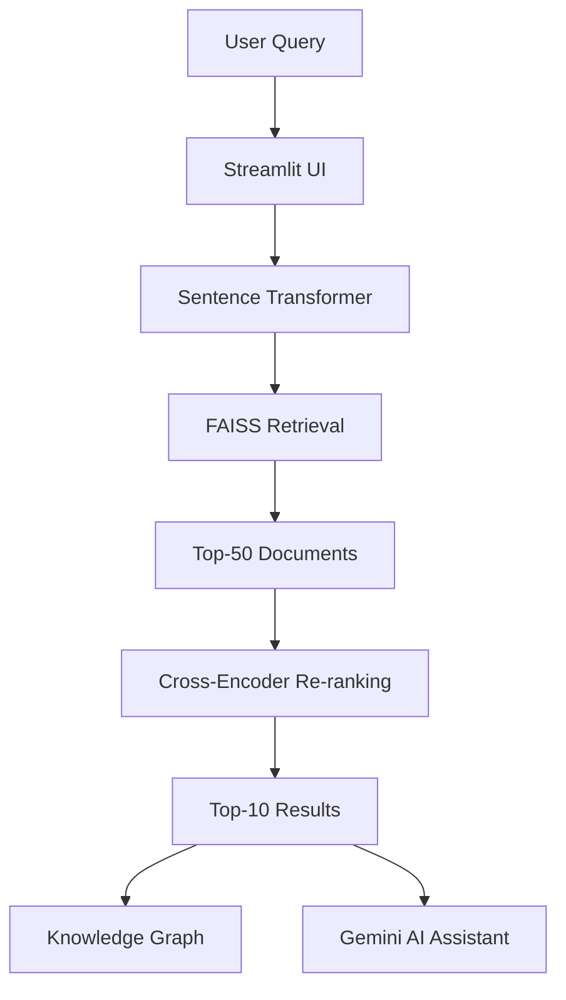

# 🦠 COVID-19 Information Retrieval (IR) System with Pre-trained LLMs and Knowledge Graph

An AI-powered Information Retrieval (IR) system that enables users to search COVID-19 research papers using semantic search. The system combines dense retrieval, FAISS vector search, Cross-Encoder re-ranking, Knowledge Graph visualization, and Google Gemini-powered Retrieval-Augmented Generation (RAG) to provide accurate and context-aware research insights.

---

## 🚀 Features

- 🔍 Semantic search over **5,000 COVID-19 research papers**
- ⚡ Dense vector retrieval using **Sentence Transformers** and **FAISS**
- 🎯 Cross-Encoder re-ranking for improved search relevance
- 🧠 AI-powered research assistant using **Google Gemini (RAG)**
- 🌐 Knowledge Graph visualization using **spaCy** and **NetworkX**
- 🔐 Secure user authentication with **MongoDB Atlas** and **bcrypt**
- ⭐ Search history and bookmark management
- 📊 Retrieval evaluation using Precision@10, Recall@10, MAP, MRR, and NDCG

---

## 🏗️ System Architecture



---

## 🛠️ Technologies Used

| Category | Technologies |
|-----------|--------------|
| Programming Language | Python |
| Frontend | Streamlit |
| Database | MongoDB Atlas |
| Embeddings | Sentence Transformers (all-MiniLM-L6-v2) |
| Vector Database | FAISS |
| Re-ranking | Cross-Encoder (ms-marco-MiniLM-L-6-v2) |
| NLP | spaCy |
| Knowledge Graph | NetworkX |
| AI Assistant | Google Gemini API |
| Authentication | bcrypt |
| Dataset | BEIR TREC-COVID |

---

## 📂 Project Structure

```
covid19-ir-system/
│── app.py
│── build_index.py
│── run_evaluation.py
│── requirements.txt
│── README.md
│── .env.example
│
├── src/
├── assets/
├── data/
├── embeddings/
├── faiss_index/
└── results/
```

---

## ⚙️ Installation

### Clone the Repository

```bash
git clone https://github.com/sharmila057/COVID-19-Information-Retrieval-IR-with-Pre-trained-LLMs-and-Knowledge-Graph.git

cd COVID-19-Information-Retrieval-IR-with-Pre-trained-LLMs-and-Knowledge-Graph
```

### Create Virtual Environment

```bash
python3 -m venv venv
source venv/bin/activate
```

### Install Dependencies

```bash
pip install -r requirements.txt
python -m spacy download en_core_web_sm
```

---

## 🔑 Configuration

Create a `.env` file from `.env.example`

```bash
cp .env.example .env
```

Update it with your credentials.

```env
MONGO_URI=your_mongodb_connection_string
MONGO_DB_NAME=covid_ir_system
GEMINI_API_KEY=your_gemini_api_key
GEMINI_MODEL_NAME=gemini-1.5-flash
```

---

## ▶️ Running the Project

### Build the FAISS Index

```bash
python build_index.py --max-docs 5000
```

### Launch the Application

```bash
streamlit run app.py
```

Open

```
http://localhost:8501
```

### Evaluate the Retrieval System

```bash
python run_evaluation.py
```

---

## 📈 Evaluation Metrics

The retrieval system is evaluated using:

- Precision@10
- Recall@10
- Mean Average Precision (MAP)
- Mean Reciprocal Rank (MRR)
- Normalized Discounted Cumulative Gain (NDCG)

---

## 📸 Screenshots

Add screenshots of:

- Login Page
- Dashboard
- Search Results
- Knowledge Graph
- AI Assistant

---

## 📌 Sample Query

```
What are the effects of remdesivir on COVID-19 patients?
```

---

## 🎯 Future Enhancements

- Hybrid Retrieval (BM25 + Dense Retrieval)
- HNSW / IVF FAISS Index
- Docker Deployment
- OAuth Authentication
- Email Verification
- Advanced Knowledge Graph Analytics

---

## 🙏 Acknowledgements

- BEIR TREC-COVID Dataset
- Sentence Transformers
- FAISS
- MongoDB Atlas
- Google Gemini API
- Streamlit
- spaCy
- NetworkX

---

## 📄 License

This project was developed for academic and research purposes.
